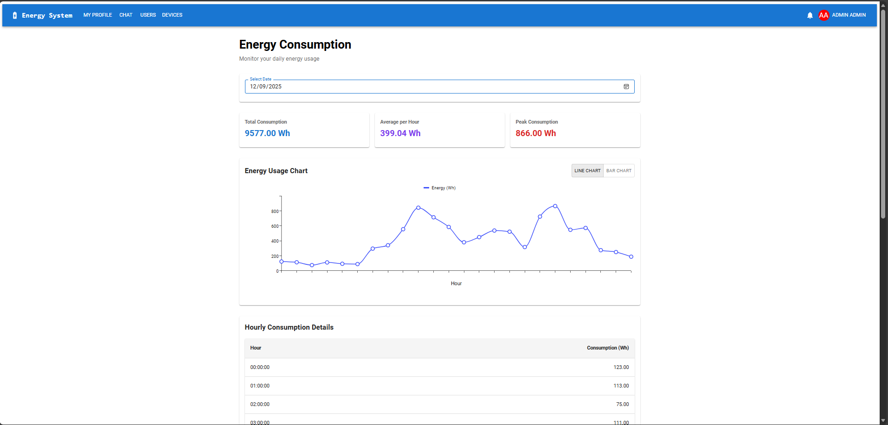
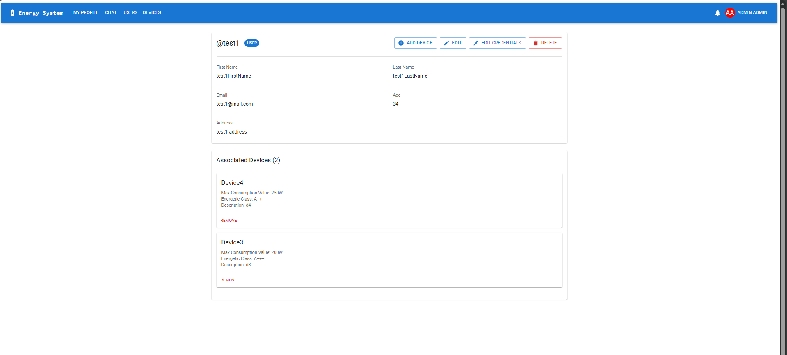
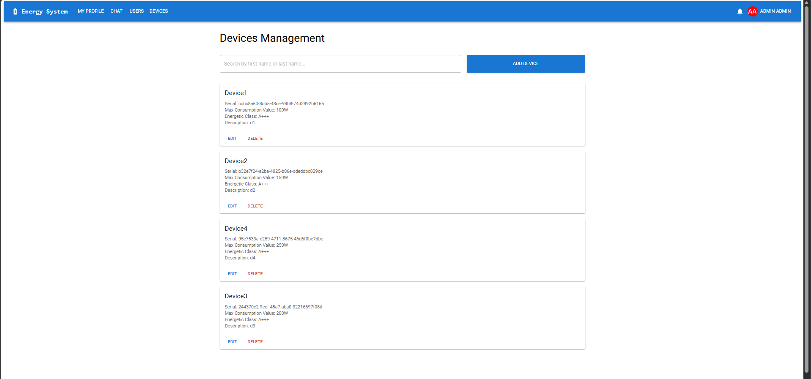
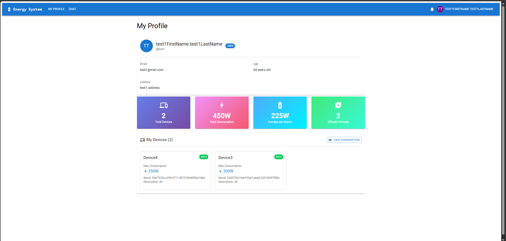
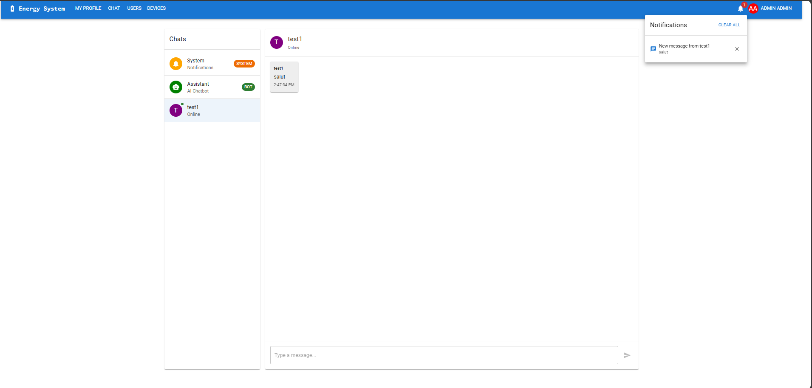
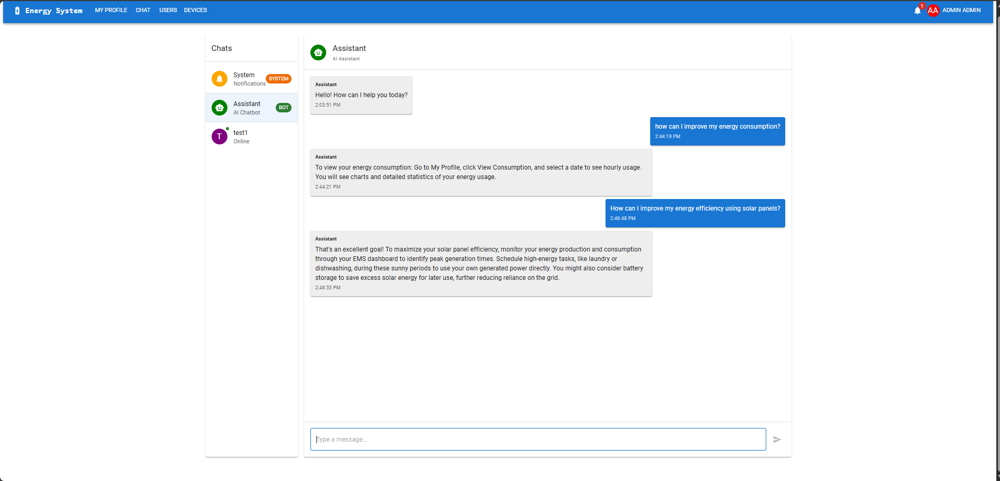
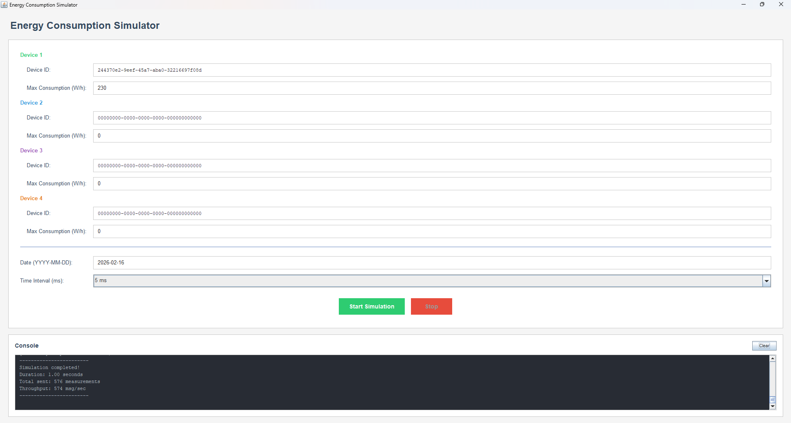

# ⚡ Energy Management System

A full-stack distributed **Energy Management System** built as a set of loosely coupled, containerized microservices. The system allows authenticated users to monitor and manage smart energy metering devices in real time, with support for asynchronous data processing, WebSocket-based notifications, AI-powered customer support, and a load-balanced monitoring pipeline.

This project was developed across three university assignments for the **Distributed Systems** course at the **Technical University of Cluj-Napoca**, covering:
- **Assignment 1** – Request-Reply Communication (REST microservices + API Gateway)
- **Assignment 2** – Asynchronous Communication (RabbitMQ, Monitoring Microservice)
- **Assignment 3** – WebSockets & Load Balancing (real-time notifications, chat, scaling)

---

## 📸 Screenshots

### Consumption Dashboard
> Clients can view their historical hourly energy consumption as interactive charts. A date picker allows selecting a specific day, with kWh values plotted per hour.



---

### User Management (Admin)
> Administrators can create, read, update, and delete user accounts from a dedicated management panel.



---

### Device Management (Admin)
> Administrators can manage smart energy devices and assign them to specific users.



---

### My Profile
> Each authenticated user has access to a profile page displaying their account information.



---

### User-to-User Chat
> Real-time bidirectional chat between clients and the system administrator, delivered via WebSockets.



---

### AI-Powered Customer Support
> The customer support microservice provides rule-based automatic replies and integrates an external LLM API for intelligent responses when no rule matches.



---

### Device Data Simulator
> A standalone desktop application that simulates smart meter readings every 10 minutes and sends them to RabbitMQ. Device ID and simulation parameters can be configured via a config file.



---

## 📐 Deployment Diagram

The UML Deployment Diagram is available in [`DeploymentDiagram.pdf`](DeploymentDiagram.pdf).

---

## 🏗️ Architecture Overview

The system is composed of the following services, all containerized with Docker and orchestrated via Docker Swarm:

| Service | Description |
|---|---|
| **Frontend (Nginx)** | React-based web client served via Nginx, with role-based pages for Admin and Client |
| **Traefik** | Reverse proxy and API gateway — routes all requests, validates JWT tokens, enforces authorization |
| **Auth Service** | Handles login/register, issues JWT tokens, stores credentials in its own PostgreSQL DB |
| **User Management Service** | CRUD operations for user accounts; publishes sync events via RabbitMQ |
| **Device Management Service** | CRUD operations for devices and user-device associations; publishes sync events via RabbitMQ |
| **Monitoring Service** | Consumes device data messages, aggregates hourly energy totals, stores results in Monitoring DB — runs as **4 replicas** |
| **Load Balancing Service** | Consumes all incoming device data from the central queue and distributes messages across monitoring replicas |
| **WebSocket Service** | Manages persistent WebSocket connections; delivers real-time overconsumption alerts and chat messages |
| **Customer Support Service** | Rule-based chatbot (10+ rules) with optional AI-driven fallback via external LLM API |
| **RabbitMQ** | Message broker for all asynchronous communication |
| **PostgreSQL (×4)** | Separate databases for Auth, Users, Devices, and Monitoring |

---

## 🗂️ Project Structure
```
├── Authorization Microservice/        # Spring Boot auth service
├── Customer Support Microservice/     # Spring Boot chatbot + AI integration
├── Device Data Simulator/             # Standalone desktop simulator app
├── Device Management Microservice/    # Spring Boot device CRUD + sync service
├── Frontend/                          # React frontend + Nginx Dockerfile
├── Load Balancing Microservice/       # Spring Boot load balancer service
├── Monitoring Microservice/           # Spring Boot consumer + hourly aggregation
├── User Management Microservice/      # Spring Boot user CRUD service
├── Websocket Microservice/            # Spring Boot WebSocket + notifications
├── dynamic/                           # Traefik dynamic routing rules
├── logs/                              # Traefik log output
├── screenshots/                       # UI screenshots for documentation
├── DeploymentDiagram.pdf              # UML Deployment Diagram
├── docker-compose.yml                 # Full orchestration definition
├── rabbitmq-definitions.json          # RabbitMQ pre-configured queues/exchanges
├── rabbitmq.conf                      # RabbitMQ configuration
├── traefik.yml                        # Traefik static configuration
└── README.md
```

---

## 🔄 Communication Flows

### Synchronous (REST via Traefik)
The Frontend communicates exclusively through Traefik, which validates the JWT and forwards requests to the correct microservice.

Auth flow: `Frontend → Traefik → Auth Service → returns JWT → stored client-side for subsequent requests`

### Asynchronous (RabbitMQ)

| Queue | Purpose |
|---|---|
| `internal.auth.user.queue` | Sync new users to Device and other services |
| `internal.auth.device.queue` | Sync new devices to all interested services |
| `external.data.collection.queue` | Receives raw readings from the Device Data Simulator |
| `internal.loadbalancer.monitoring.queue.{1..4}` | Per-replica ingestion queues fed by the Load Balancer |
| `internal.monitoring.device.alert.queue` | Overconsumption alerts from Monitoring to Device Service |
| `internal.device.websocket.user.notification.queue` | Real-time notifications delivered via WebSocket to users |

---

## 🚀 Getting Started

### Enable Docker Swarm
```bash
docker swarm init
```

### Deploy the full stack
```bash
docker stack deploy -c docker-compose.yml ems
```

### Stop the Stack
```bash
docker stack rm ems
```

---

## 🌐 Accessing the Services

| Service | URL |
|---|---|
| **Frontend** | http://localhost |
| **Traefik Dashboard** | http://localhost:8080 |
| **RabbitMQ Management UI** | http://localhost:15672 (guest / guest) |
| **Auth DB** | localhost:5432 |
| **User DB** | localhost:5433 |
| **Device DB** | localhost:5434 |
| **Monitoring DB** | localhost:5435 |

---

## 🔐 User Roles

| Role | Capabilities |
|---|---|
| **Admin** | Full CRUD on users and devices, device-to-user assignment, participate in support chat as operator |
| **Client** | View own assigned devices, view personal energy consumption charts by day, use customer support chat |

---

## 🤖 Device Data Simulator

The simulator is a standalone desktop application that mimics smart meter behavior:

- Generates energy readings every **10 minutes** (configurable via `SIMULATOR_DELAY_MS`)
- Simulates realistic daily patterns — lower consumption at night, higher in the evening, with small random fluctuations
- Sends data as JSON to RabbitMQ: `{ timestamp, device_id, measurement_value }`
- Connects to RabbitMQ at `localhost:5672` on queue `external.data.collection.queue`

**Configuration:** Edit the simulator's config file to set the `device_id` before starting a simulation session.

---

## ⚖️ Load Balancing

The Load Balancing Service sits between the Device Data Simulator and the Monitoring replicas:

- Consumes all data from `external.data.collection.queue`
- Distributes messages across 4 dedicated queues: `internal.loadbalancer.monitoring.queue.{1..4}`
- Each Monitoring replica is identified at runtime via `{{.Task.Slot}}` — a Docker Swarm variable injected as `REPLICA_ID`

---

## 💬 Customer Support

Two tiers of automated support:

1. **Rule-based responses** — keyword matching across 10+ predefined rules covering common questions about devices, consumption, and accounts
2. **AI-driven fallback** — if no rule matches, the message is forwarded to an external LLM API (Gemini / OpenAI / Mistral / Hugging Face) and the response is returned to the user

All chat messages are delivered in real time via the WebSocket Microservice, enabling bidirectional communication between clients and the administrator.

---

## 🔔 Real-Time Overconsumption Notifications

When the Monitoring Service detects that a device's hourly total exceeds its maximum consumption limit:
```
Monitoring Service
  → publishes alert to internal.monitoring.device.alert.queue
    → Device Management Service picks up alert
      → publishes to internal.device.websocket.user.notification.queue
        → WebSocket Service delivers notification instantly to the user's browser
```

---

## 🛠️ Key Environment Variables

| Variable | Description |
|---|---|
| `PORT` | Internal port the Spring Boot service listens on (8080) |
| `DB_IP`, `DB_PORT`, `DB_USER`, `DB_PASSWORD`, `DB_DBNAME` | PostgreSQL connection settings |
| `RABBITMQ_HOST`, `RABBITMQ_PORT`, `RABBITMQ_USERNAME`, `RABBITMQ_PASSWORD` | RabbitMQ connection settings |
| `RABBITMQ_*_QUEUE` | Named queues used by each service |
| `REPLICA_ID` | Injected by Docker Swarm as `{{.Task.Slot}}` |
| `SIMULATOR_DELAY_MS` | Processing cycle delay in the Monitoring Service (ms) |
| `AUTH_SERVICE_HOST` | Full URL of the Auth Service (used for token validation) |
| `SUPPORT_SERVICE_HOST` | Full URL of the Customer Support Service |

---

## 🧰 Technologies Used

| Layer | Technology |
|---|---|
| Frontend | React + Nginx |
| Microservices | Java Spring Boot |
| Message Broker | RabbitMQ |
| Reverse Proxy / API Gateway | Traefik |
| Databases | PostgreSQL |
| Containerization | Docker + Docker Swarm |
| Real-time Communication | WebSockets |
| AI Integration | External LLM API (Gemini) |

---